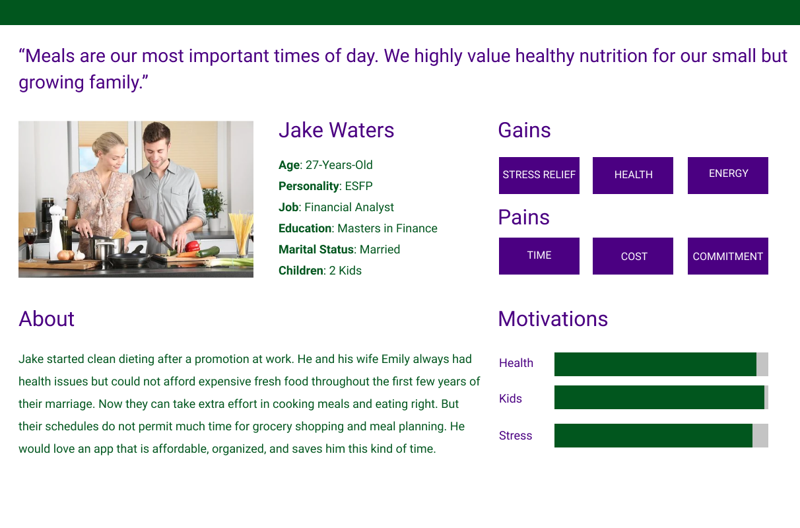
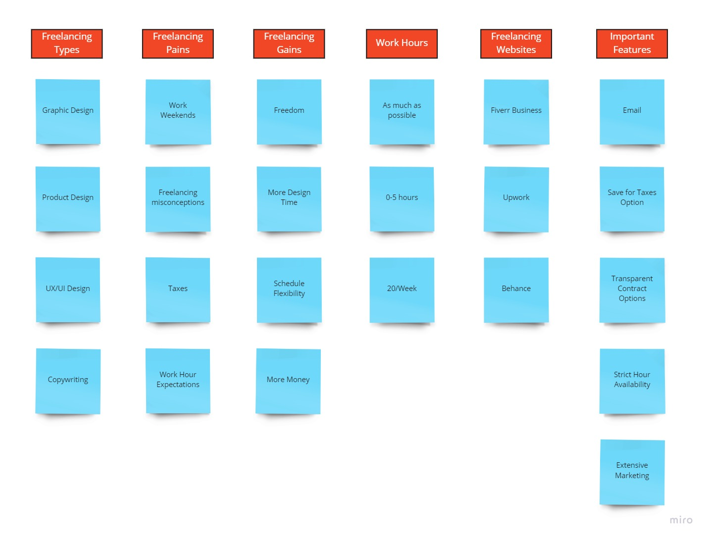
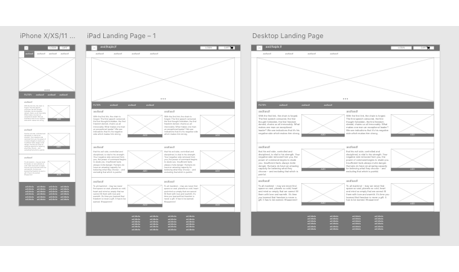

# Welcome to my UX-UI portfolio. 

## I have designed and developed it using these tools: 

1. React.js frontend framework
2. MUI-5 styling for React.js

## If you would like to view this complete project, feel free to check it out by using this link: 

https://aubrey-jones-ux-ui-portfolio.netlify.app/

## Here are some images of my UX-UI Work: 

### Proto Persona

### Affinity Diagram

### Wireframes

### Feel free to reach out to me if you have any questions and happy coding! 

